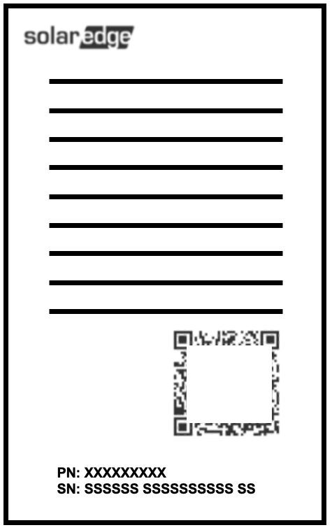

# ApiMinerSolarEdge

Document for `SolarEdge` inverter `API Miner`.

When an `Arkreen` user want to add their `SolarEdge` inverters to `Arkreen Network` as `API Miner`, they need provide 2 key information:
* `Site ID`, which be used to specific the power plant that `Arkreen Network` can access, can be found in SolarEdge Monitoring Service,
* `API Key`, which be used to authorize `Arkreen Network` to access your site data;


There are 3 methods can be used to get the `Site ID` and `API Key`:
* Generated in [SolarEdge Monitoring Service](https://monitoring.solaredge.com/)
* Ask your `installer` through email
* Get them from [SolarEdge Chat Support](https://www.solaredge.com/us/support)

We recommend you get the `Site ID` and `API Key` via the [SolarEdge Chat Support](https://www.solaredge.com/us/support), please follow the steps below:

# SolarEdge Chat Support

## Step 1

Click the link to go to [SolarEdge Chat Support](https://www.solaredge.com/us/support).

## Step 2

Click `Chat with an Agent`, Before you get connected with a representative, you must answer a series of questions.

## Step 3

Enter your email address linked to your `SolarEdge` account.

## Step 4

Enter the `serial number` for your inverter. the `serial number` can be found in `SolarEdge` inverter `nameplate`, named `SN` usually, for example:



## Step 5

Once connected with a live chat representative. Copy and paste the following message into the chat: 

```
Hi, I need to get my API keys so that I can track the energy output of my panels. The site ID for my inverter is: (paste in your serial number)
```